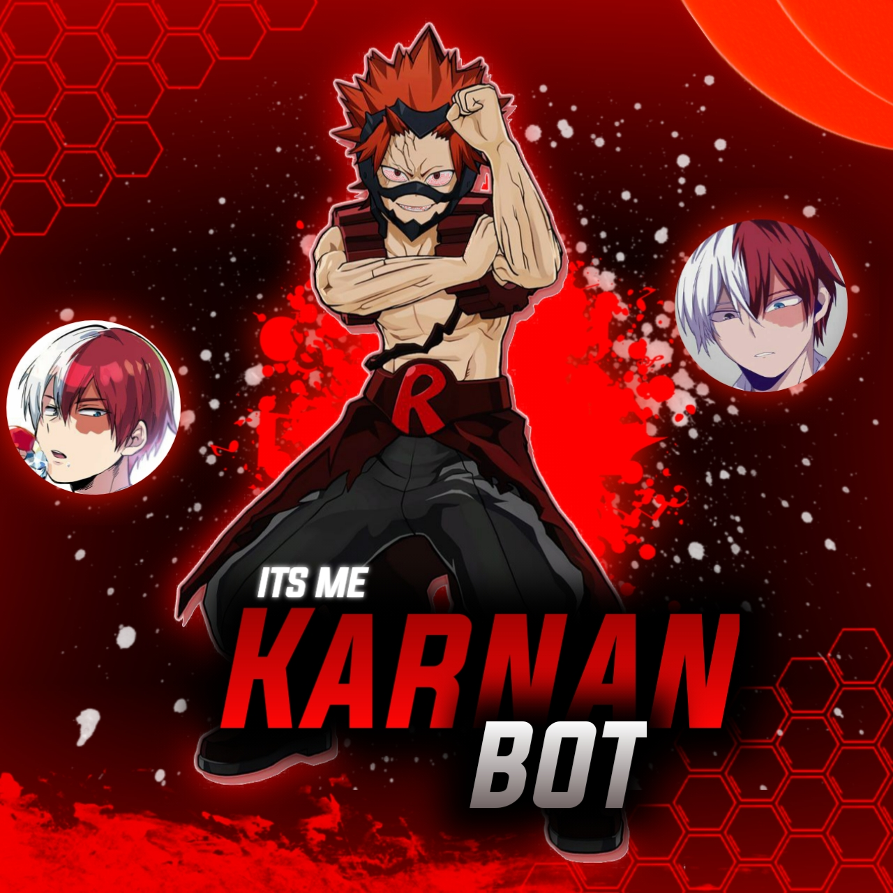

<div align="center">
  
  <p align="center">
<a href="#"></a>
</p>

<!---------- Typing SVG ---------->
<p align="center">
    <a href="https://avatars.githubusercontent.com/u/85664936?v=4">
        
    </a>
</p>


  <p align="center">
<a href="https://github.com/TheBlackLion17"></a>
</p>
</div>
<p align="center">
Project created by <a href="https://github.com/TheBlackLion17">TheBlackLion17</a> to make it public
    <br>
       | © |
        Reserved |
    <br> 
</p>

----

  <p align="center">
  <a href="httsp://github.com/TheBlackLion17/Karnan">
    
<p align="center">
<a href="https://github.com/TheBlackLion17/followers"></a>
<a href="https://github.com/TheBlackLion17/Karnan/stargazers/"></a>
<a href="https://github.com/TheBlackLion17/Karnan/network/members"></a>
<a href="https://github.com/TheBlackLion17/Karnan/watchers"></a>
<a href="#">
</p>
  
  #### TOTAL REPO VIEWS📍


## 📢 Guide
  
  
  
**Click WA logo to Join Support Group 👇👇**[**PASSWORD IN IT**]
    <br>
<br>
  [](https://chat.whatsapp)
  <div align="center">
       
  [](https://github.com/TheBlackLion17/Karnan)
  </div>
    
# Setup
<div align="center">
  
## STEPUP VIDEO 👇🏻👇 [ IF ANY DOUBT TO STEP ]
  

  
  

  
  
 
  
  
  
  


### **👇🏻👇🏻CLICK THE WEBSITE LOGO TO SET THE BOT(THIS WILL REDIRECTED TO  MY WEBSITE)👇🏻👇🏻**
  
 ```
꧁༒☬𝓢𝓣𝓔𝓟 𝓣𝓞 𝓕𝓞𝓛𝓛𝓞𝓦☬༒꧂
  
  
  •  CLICK THE LOGO
  
  
     •  READ FULL IF YOU HAVE TIME
  
  
       •  SCROLL DOWN AND GIVE YOUR FEEDBACK
  
  
         •  THERE WILL BE TWO BUTTON IN DOWN [NAMED AS  QR CODE & DEPLOY]
  
  
           •  FIRST CLICK SCAN QR CODE & THEN CLICK THE DEPLOY BUTTON
  
  
  
  
  HOPE YOU UNDERSTAND IF YOU NEED HELP 
  YOU CAN FEEL FREE TO CONTACT ME
  ON WHATSAPP 
 [ NUMBER IN THIS REPO LAST YOU CAN SCROLL DOWN]
``` 
<div align="center">
  
[](https://Karnan-bot.yolasite.com)
  
     
    
<div align="center">
<br>
<br >

### ANY DOUBT CLICK THE YOUTUBE LOGO👇🏻👇🏻  
  
  
 [](https://tinyurl.com/yjrwk2u6)

    
    
    
    
    
    
### 📃 How Can I Download the Bot Script?

You Can **[Click Here](https://github.com/TheBlackLion17/Karnan/archive/refs/heads/TheBlackLion17.zip)** To Download The **Bot Script**.. This Script is Free, So **Don't Sell This Script in High Price.** 
        
            
 ### F.A.Q
    
    
Answer a few frequently asked questions;
    
### Can you read my messages?
    
This project is open source so all the codes are clear. Neither less nor more; you can look what you want. **We absolutely do not have access to your accounts.**


    
### What about our security?
    
    
If you are concerned about security, you can install it on your own computer. If you think someone else has captured your data, simply click on **Whatsapp> Three Dots> Whatsapp Web> Logout** from all sessions button.


    
### Is it paid?
    
**Of course not.** It will never happen.
    
    
### ❗ Does our number will banned from WhatsApp by Using This Bot?

If you are concerned about that, Then you can just use bot on a [Fake Number](https://youtu.be/v8lGcQp0RjQ). **[Also Read This Warning](https://github.com/TheBlackLion17/Karnan#-warning-)**

### 🔄 Can I Edit this bot?

**As per the license, You Can** But We Will Not Support. 🙃   
    
    

## ⚠ Warning ⚠

```
By using kick, add, promote, demote Commands, Your WhatsApp account may be banned.
Karnan or we are not responsible for your account, 
This bot is intended for the purpose of having fun with some fun commands 
and group management with some helpfull commands.

If  you ended up spamming groups, getting reported left and right, 
and you ended up in being fight with WhatsApp
and at the end WhatsApp Team deleted your account. DON'T BLAME US.

No personal support will be provided / We won't spoon feed you. 
If you need help
you can contact 👇🏻👇🏻 
```
**[](https://wa.me/message/7UBLBAJZHISYH1)**
    
## **Developers & Supporters**
          
  <div align="center">
    
  [](https://github.com/TheBlackLion17) | [](https://github.com/farhan-dqz) |  [](https://github.com/AI-VIKI) | [](https://github.com/afnanplk) 
----|----|----|----
[TheBlackLion17](https://github.com/TheBlackLion17)  | [farhan-dqz](https://github.com/farhan-dqz)  | [saidali](https://github.com/saidalisaid2) | [afnanplk](https://github.com/afnanplk)
Base, Bug Fixes, Modules | Base, Bug Fixes, Modules | Base, Bug Fixes, Modules | Base, Bug Fixes, Modules 
  </div>
    


## License
This project is protected by `GNU General Public Licence v3.0` license.

### Disclaimer
`WhatsApp` name, its variations and the logo are registered trademarks of Facebook. We have nothing to do with the registered trademark
  
  
  
  
  
  
